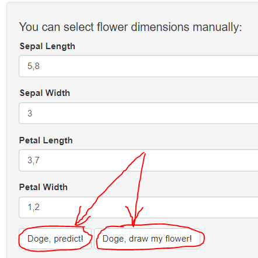
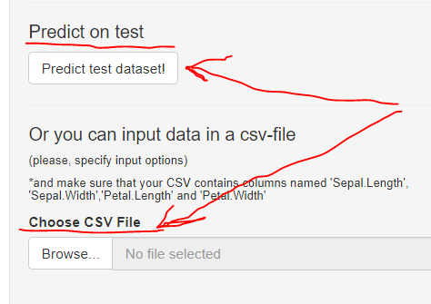

<style>
body {
text-align: justify}
</style>

```{r setup, include=FALSE}
knitr::opts_chunk$set(echo = FALSE)
```

## Description

**Doge** - is a simple Shiny application that implements prediction modelling for purposes of flower classification.

### Bio
Doge is a very intelligent dog. He loves flowers, particularly irises.

In fact, he loves them so much so that he can classify them into 3 species with a very high accuracy (~97% on average) and **he can draw them too**!

(the last part is debatable though).

## Doge can:

- Predict results for manual input and create "beautiful" art:




## Doge can also:
- Make multiple predictions (if you have a bouquet of flowers) with test dataset or your own dataset:




## With Doge you can:

- Download a test dataset 
- Download a CSV-output of multiple predictions
- Enjoy Doge's masterpeace
- Become a connoisseur of irises

check him out here:

https://kasenkov.shinyapps.io/developoing_data_products/ 
